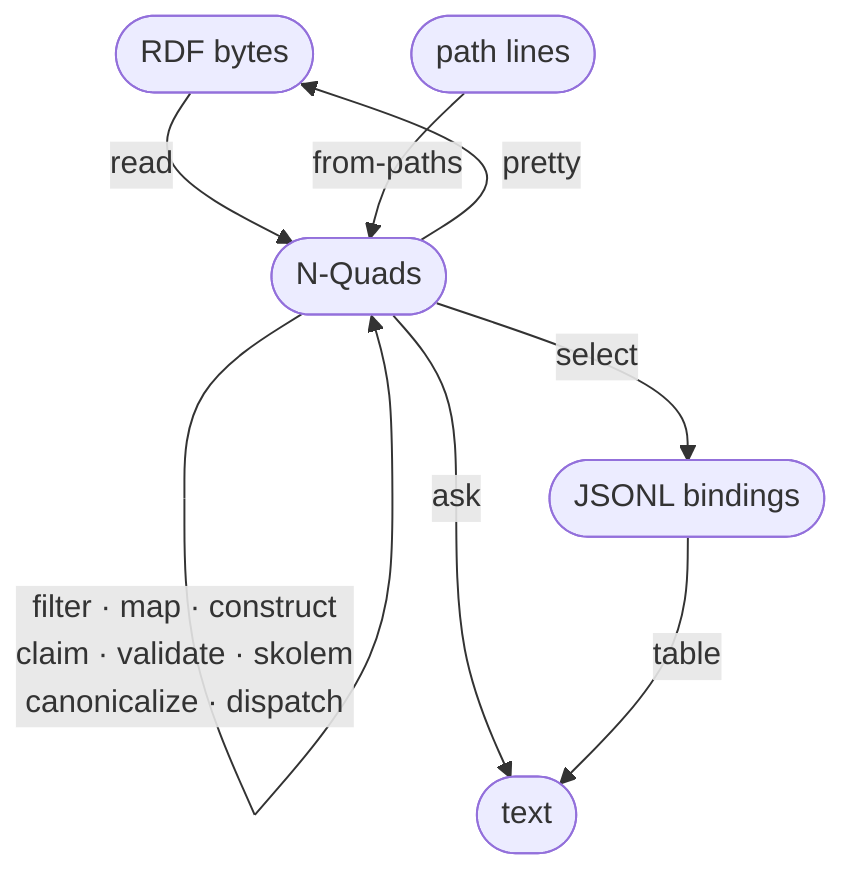

# [rdf-cli](osg://repo/github.com/cristianvasquez/rdf-cli)

`rdf`: RDF commands that compose over Unix pipes. Install: `npm install -g rdf-cli`.

## Commands

Nodes are stream kinds; edges are commands.

<!-- generated:diagram -->

<!-- /generated:diagram -->

<!-- generated:table -->
| command | in → out | purpose |
| --- | --- | --- |
| `read` | RDF bytes → N-Quads | Parse RDF files or stdin into N-Quads. |
| `from-paths` | path lines → N-Quads | Parse the files named on stdin, one path per line, into N-Quads. |
| `filter` | N-Quads → N-Quads | Keep the quads where a SPARQL expression is true. |
| `map` | N-Quads → N-Quads | Rewrite the quads that match --where with SPARQL expressions. |
| `select` | N-Quads → JSONL bindings | Run a SPARQL SELECT and emit the bindings as JSON Lines. |
| `construct` | N-Quads → N-Quads | Run a SPARQL CONSTRUCT and emit its triples, graphless. |
| `ask` | N-Quads → text | Run a SPARQL ASK and print true or false; exit 1 on false. |
| `claim` | N-Quads → N-Quads | Apply one claimer: claimed quads and views move into named graphs. |
| `validate` | N-Quads → N-Quads | Validate against SHACL shapes; append the report as a named graph; exit 1 on non-conformance. |
| `skolem` | N-Quads → N-Quads | Replace blank nodes with generated IRIs, one IRI per blank node in the run. |
| `canonicalize` | N-Quads → N-Quads | Emit the RDFC-1.0 canonical form. |
| `dispatch` | N-Quads → N-Quads | Write each named graph under ROOT to a file; pass the other quads on. |
| `pretty` | N-Quads → RDF bytes | Render as TriG (default), Turtle, N-Quads, or N-Triples; any other format is an error. |
| `table` | JSONL bindings → text | Render bindings as CSV or TSV. |
<!-- /generated:table -->

`rdf <command> --help` gives the arguments. [`spec/manifest.hs`](spec/manifest.hs) gives the contract: types, laws, library API.

## Rules

- Between commands, data is N-Quads.
- Graphless quads stay graphless. Only `map -g` and `read --graph-from path` add graphs; `map -g default` removes them.
- Each input file is its own blank-node scope. Labels do not change between commands.
- In `filter` and `map`, an expression sees one quad: `?s ?p ?o ?g`. `?g` is unbound in the default graph.
- An error goes to stderr and gives exit code 1. No failure is silent.
- Input formats: `trig`, `turtle`/`ttl`, `nquads`/`nq`, `ntriples`/`nt`, `jsonld`/`json`, `rdfxml`/`xml`, `n3`. From the file extension, or `--format`.

## Recipes

The smoke test runs each block from a copy of the repository.

```sh
# Add a graph to graphless quads; remove all graphs
rdf read examples/data/*.ttl | rdf map --where '!bound(?g)' -g '<urn:batch>' | rdf pretty
rdf read examples/data/two-graphs.trig | rdf map -g default | rdf pretty --format turtle
```

```sh
# Keep English literals and all non-literals
rdf read examples/data/*.ttl | rdf filter 'coalesce(langMatches(lang(?o), "en"), true)'
```

```sh
# Change a namespace
rdf read examples/data/*.ttl \
  | rdf map --where 'strstarts(str(?s), "http://example.org/")' \
            -s 'iri(replace(str(?s), "^http://example.org/", "https://example.com/"))'
```

```sh
# Query to CSV; test a condition with the exit code
rdf read examples/data/*.ttl | rdf select 'SELECT ?s ?name WHERE { ?s <http://xmlns.com/foaf/0.1/name> ?name }' | rdf table
rdf read examples/data/*.ttl | rdf ask 'ASK { ?s a <http://xmlns.com/foaf/0.1/Person> }'
```

```sh
# Compare two files, independent of blank-node labels, order, and syntax
diff <(rdf read examples/data/two-graphs.trig | rdf canonicalize) \
     <(rdf read examples/data/two-graphs.nq | rdf canonicalize)
```

```sh
# One graph per file, rename the graphs, write each graph to its own file
rdf read --graph-from path 'examples/data/*.ttl' \
  | rdf map -g 'iri(replace(str(?g), "^file://./examples/data/", "file://./out/"))' \
  | rdf dispatch file://./out/ --destination out
```

```sh
# Validate: the report is appended as a named graph; exit 1 on non-conformance
rdf read tests/fixtures/person-valid.ttl | rdf validate --shapes tests/fixtures/person-shape.ttl --markdown-report > /dev/null
```

```sh
# Claim: claimed quads and views move into named graphs; the rest stays graphless for the next claim
rdf read tests/fixtures/person-valid.ttl | rdf claim tests/fixtures/person-claimer.trig | rdf pretty
```

Claimer design: [`spec/claim.md`](spec/claim.md).

## Library

```js
import { sources, transforms } from 'rdf-cli'   // also: sinks, pipeline

const store = await transforms.materialize(sources.readFromGlob(['./data/**/*.ttl']))
for (const row of transforms.select(store, 'SELECT ?s ?o WHERE { ?s ?p ?o }')) console.log(row.s.value)
```

`pipeline` composes operations and records their provenance as PROV-O. Signatures: [`spec/manifest.hs`](spec/manifest.hs).
